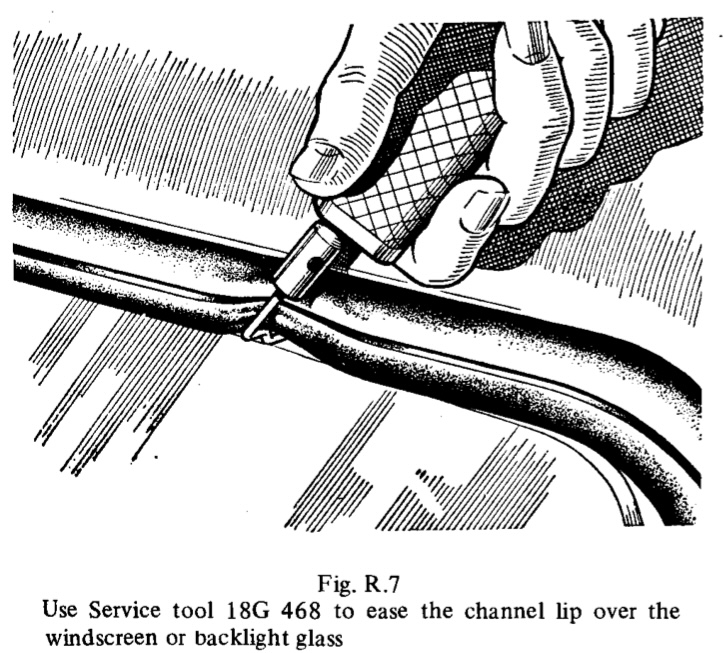
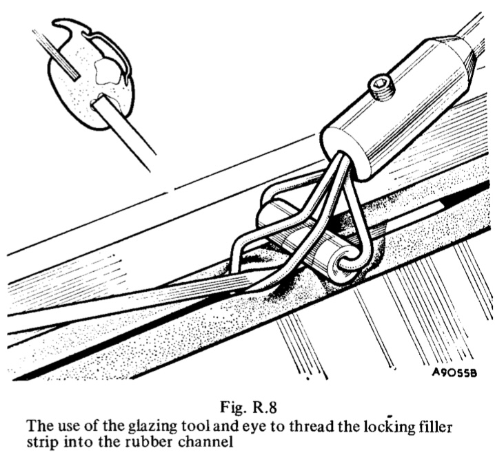

# WINDSCREEN AND BACK-LIGHT GLASSES (GT)</strong>

## Removing

Lift the windscreen wiper arms clear of the glass. Remove the finisher strip.

Prise up the end of the locking filler and carefully pull it from the channel in the surround rubber. Press the glass from inside the car, commencing at a corner, and ease the surround rubber from the metal edge of the body aperture.

## Refitting

If the glass has been broken, remove any pieces which remain in the channel. Examine the rubber, and use a new rubber should there be any signs of damage or deterioration.

Fit the surround rubber to the body aperture and lubricate the ‘glass’ channel with a soap-and-water solution. Place the glass into the lower channel of the rubber surround and commence at the corner to lift the lip of the rubber over the glass, using Service tool 18G 468. Use the short peg on the handle of the installation tool for this purpose.

Alternatively you can install the surround rubber around the glass first then add a cord to the surround rubber overlapping at the bottom middle of the windshield. With two people on the outside place the windshield in the body aperture. Have a person on the inside pull up on the cord towards the middle of the windshield which places the lip of the surround rubber over the body aperture while the two on the outside gently push on the windshield with their palms. Continue pulling on the cord until you get around the windshield surround rubber.

Apply a soap-and-water solution to the locking filler strip channel to assist in fitting the strip. 

Using Service tool 18G 468 with adaptor 18G 468 A, thread the end of the filler strip through the eye of the adaptor and under the roller. Lay the filler strip in position over the groove in the surround rubber. Insert the eye of the tool in the filler strip groove, hold the filler strip in position, and commence to push the tool along the groove, rolling the strip into position. A slight side-to-side action will assist when rounding the corners.

After completing the circuit cut off any surplus strip to make a neat’ butt joint at the centre-line of the glass. _Ensure that the filler strip is fitted with its thicker section facing towards the glass of the windscreen._

**NOTE.—In the event of windscreen breakage, minute particles of glass fall into the windscreen demister ducts and tubes. When the blower motor is switched on these particles are discharged into the driver’s or passenger’s face. The demister ducts and tubing must be disconnected from the heater box and blown out before the new windscreen glass is fitted.**
